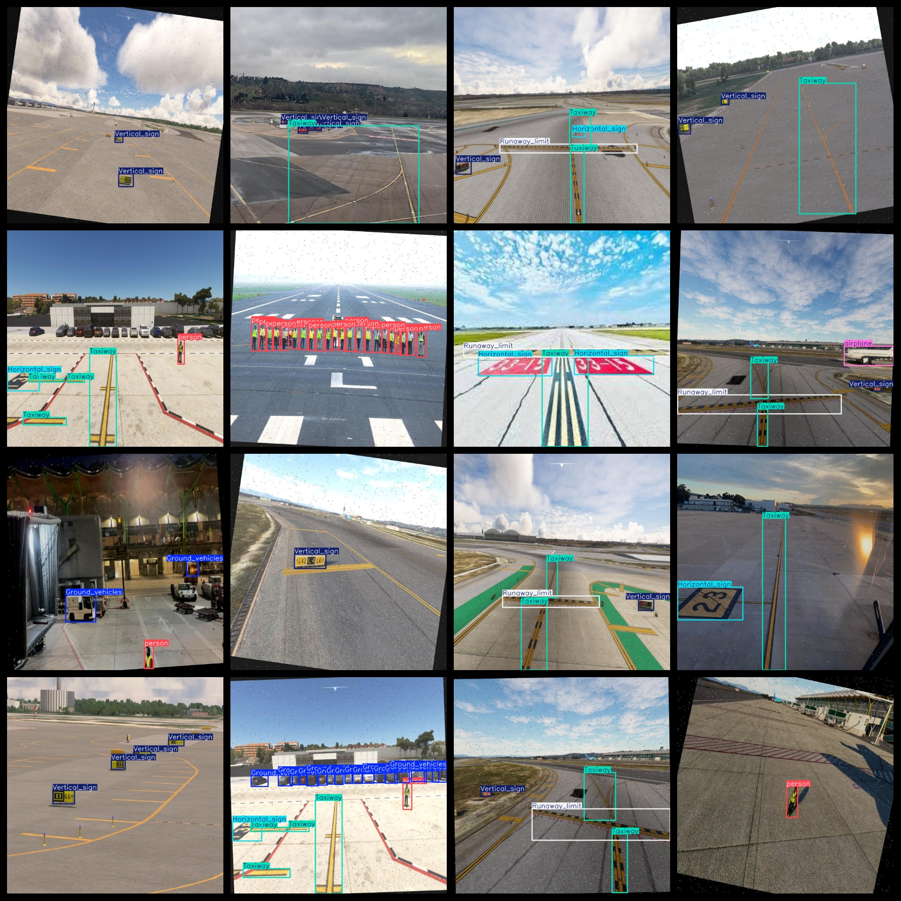
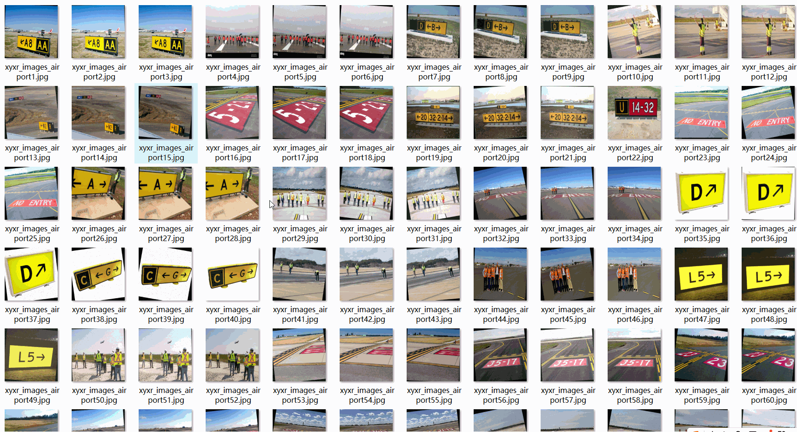

# [Object Detection] Airport Inside Target Detection Dataset 4106 images in YOLO+VOC format

The "Airport Inside Target Detection" dataset consists of 4106 images in both YOLO and VOC formats.

The dataset is organized in three folders: JPEGImages, Annotations, and labels.

The JPEGImages folder contains a total of 4106 jpg images.

The Annotations folder contains a total of 4106 xml files.

The labels folder contains a total of 4106 txt files.

There are a total of 7 label categories: ["Ground_vehicles", "Horizontal_sign", "Runaway_limit", "Taxiway", "Vertical_sign", "airplane", "person"].

The Chinese translation for each label category is as follows:

- Ground vehicles: ground vehicles
- Horizontal sign: horizontal sign
- Runaway limit: Runway limit
- Taxiway: Skidway
- Vertical sign: Vertical sign
- Airplane: airplane
- Person: Human

The number of boxes (not the order in the yolo format) per label category is as follows:

- Ground vehicles: 3127
- Horizontal sign: 2595
- Runaway limit: 1320
- Taxiway: 4091
- Vertical sign: 2918
- Airplane: 1832
- Person: 2026

Total box count: 17909

The image resolution is clear with a high degree of detail.

The images have been enhanced.

The shape of the labels is a rectangular box, used for target detection identification.

Important Notes: There are no specific notes provided at this time.

Special Remarks: The dataset does not guarantee the accuracy or precision of any trained models or weight files. The dataset is only provided with accurate and reasonable annotations.
## Images

---

Here is a pay link on Stripe (https://buy.stripe.com/3cs8yP7sY87d0vu9AB). Please contact me lonlonago@foxmail.com after funding $89, and I will send you a complete data files, thank you!

